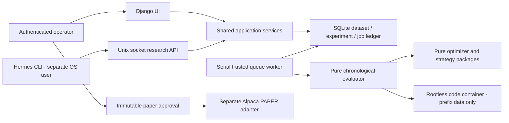

# Architecture and code walkthrough

## Files to read in order

1. `strategies/catalog.py`: formulas and assumptions for each registered method.
2. `optimizer/covariance.py`, `optimizer/advanced.py`, `optimizer/risk.py`: estimation, convex models, duals, and metrics. No Django imports.
3. `strategies/builtin.py`: allocation and signal rules. Sample/Ledoit–Wolf/EWMA/PCA covariance; capped risk parity/HRP; Bayesian absolute views; lagged ridge. All inputs are explicit.
4. `backtest/engine.py`: information timing, drift, cash, rebalancing and actual transaction costs. Signals after close execute next close. Fees solve a small fixed point because targets are fractions of wealth after costs.
5. `research/models.py`: frozen dataset, versioned source, experiment ledger, durable job.
6. `research/services.py`: freeze aligned prices, validate configurations, queue/run experiments, record git/source/dependency hashes and results.
7. `research/jobs.py`: one consumer, failed/interrupted trial recording. Restarted work is marked failed rather than automatically rerun.
8. `portfolio_lab/cli.py`, `research/rpc.py`: JSON command interface and limited Unix socket capabilities. A remote client loads no Django settings or `.env`.
9. `workers/isolation.py`, `workers/entry.py`: rootless runtime checks, fixed image ID, bounded protocol and disposable containers. Source registration only parses; execution always occurs in the container.
10. `portfolio/views.py`, `portfolio/forms.py`, templates/static: authenticated thin service callers, Plotly JSON, local KaTeX, sanitized text review.
11. `paper/broker.py`, `paper/services.py`: paper endpoint, approval fingerprint, stale-data gate, hashed decision input snapshots, whole-share limit orders, durable intent, reconciliation and stop controls. Orders reference immutable `PaperDecision` inputs.

## Deliberate boundaries

- One operator, local loopback UI, SQLite, one queue consumer, one unrevoked paper session.
- Daily liquid ETF allocation. No live execution endpoint or configurable broker URL.
- Holdout is operator-only at the socket interface; notebooks receive only training data. Builtin methods receive chronological prefixes.
- A dataset digest covers prices and manifest; registration hashes exact Python source. Approved paper sessions bind configuration, dataset, strategy, evaluator/dependency provenance and reviewed results.
- Validation and holdout use the same evaluator. A new trial ID is generated even for duplicate configurations so selection history remains visible.
- Deployment, accounts for multiple researchers, options execution, geometry, cardinality mixed-integer models and a production market microstructure simulator are outside this implementation.
