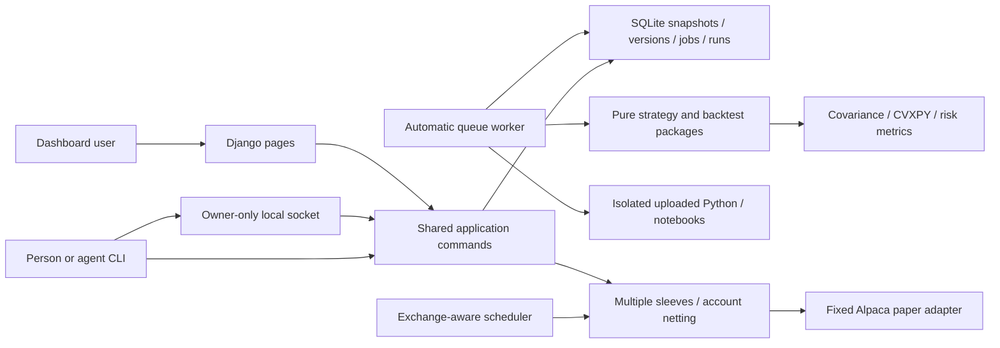

# Architecture and code walkthrough

## Read the code in this order

1. `strategies/catalog.py`: available methods, equations, and assumptions. `strategies/recipes.py` composes forecasts, allocation, and overlays; incompatible choices are rejected.
2. `optimizer/advanced.py`: convex programs, ratio transformations, signed bounds, duals, and the long-only frontier. `strategies/builtin.py` implements the existing allocations and covariance choices. These packages have no Django imports.
3. `backtest/schedule.py` defines calendar periods. `backtest/engine.py` applies chronological signals, delayed execution, drift, costs, and optional short borrow/financing. Caps constrain rebalance targets, not intervening market drift.
4. `research/models.py` stores immutable evidence and job state; `research/services.py` freezes/validates/runs experiments and hashes provenance. Execution-time provenance is recorded separately from older queued provenance when code changed before processing.
5. `research/datasets.py` validates symbol/date/feed requests, fetches background previews, and accepts frozen snapshots with explicit coverage/exclusion metadata. Benchmark history can be separate from allocated assets.
6. `research/commands.py` defines shared operations used by the UI and CLI. `portfolio_lab/cli.py` parses files/flags and selects direct or socket transport; `research/rpc.py` enforces owner-only access and recovers stale sockets. There is no agent-specific role.
7. `research/jobs.py` serializes work with a host lock, records failures, and exposes health. `research/scheduler.py` refreshes completed execution inputs and triggers eligible account cycles. `portfolio_lab/app.py` starts the foreground stack; `server/` provides user services and an explicit installer.
8. `portfolio/` contains thin forms/views, safe result presentation, local Plotly/KaTeX assets, progress polling, compare selection, trash/restore, and account controls. `portfolio/activity.py` hashes lightweight list revisions; `live.js` updates changed lists and selection options without replacing draft forms. Dataset submissions redirect after success and show prominent errors on rejection; completed previews require explicit saving.
9. `workers/` validates rootless resource enforcement and runs submitted source/notebooks with chronological/training inputs only. Source registration never executes the submission.
10. `paper/account.py` reserves sleeve funding, checks immutable execution versions, reconciles cumulative fills, freezes decisions, crosses internal demand, and submits residual account orders. `paper/broker.py` is the only actual trading adapter. `paper/services.py` retains compatibility names and historical-order reconciliation; it routes all new execution through account netting.

## Persistent boundaries

- One owner, SQLite, localhost dashboard/SSH tunnel, one queue consumer, one scheduler, and several account sleeves.
- `optimizer/`, `strategies/`, `backtest/` remain pure Python.
- Dataset snapshots, strategy versions, results, and execution input records are retained. Trash affects visibility and cancels queued work; it does not rewrite evidence.
- Signed portfolios are supported in research; connected-account execution remains long-only with whole-share limit orders. No live endpoint, options contracts, or ETF holdings-import feature exists.
- Authenticated dashboard and owner-authorized CLI have equivalent actions. Uploaded code remains isolated independently of caller identity.
- The original `portfolio.OptimizationRun`, `PaperDecision`, and `PaperOrder` records remain migration-compatible. New execution uses `AccountCycle` and `AccountOrder` linked to multiple `PaperSession` sleeves. Existing sessions migrate paused.
- Source/runtime changes require reevaluation before activation/resume. Unknown submissions remain blocked rather than guessed or blindly resent.
